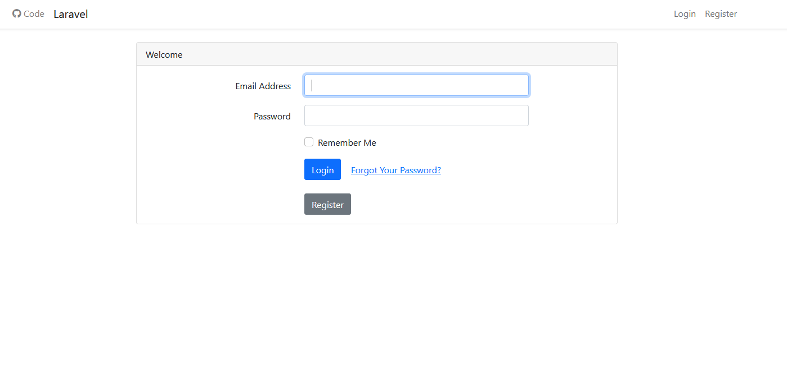
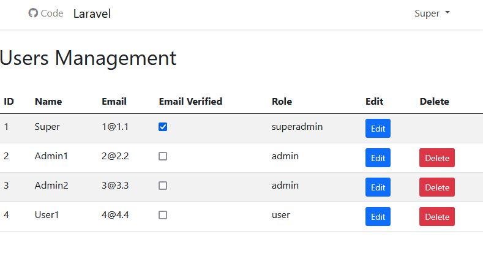
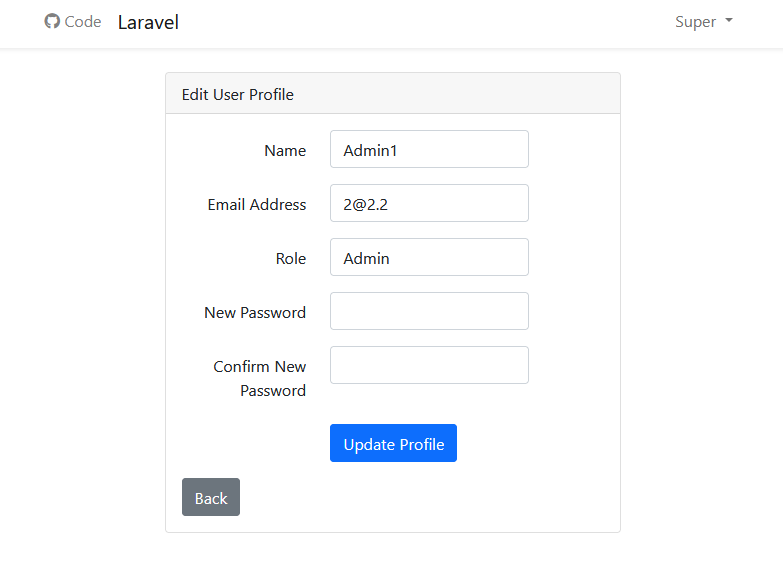
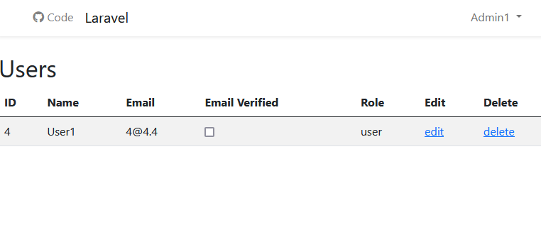
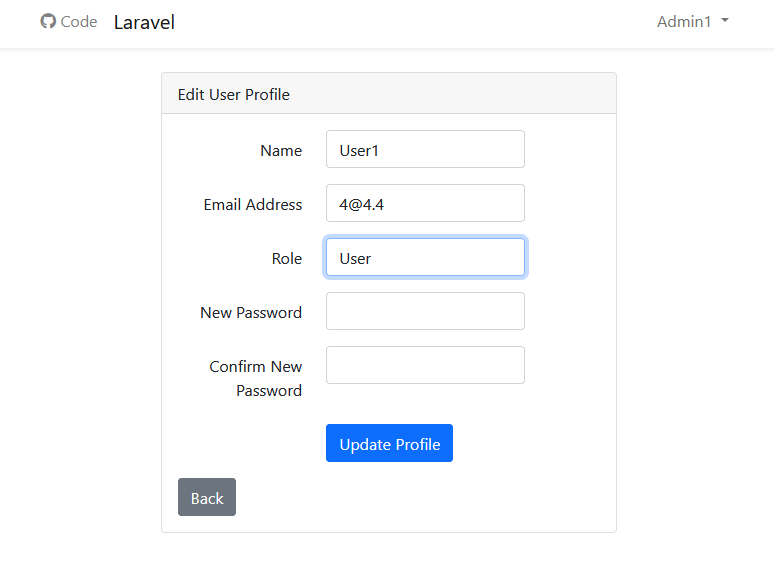
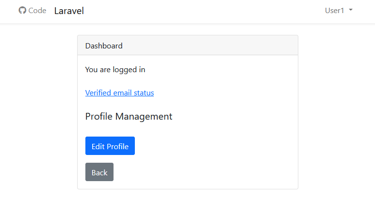
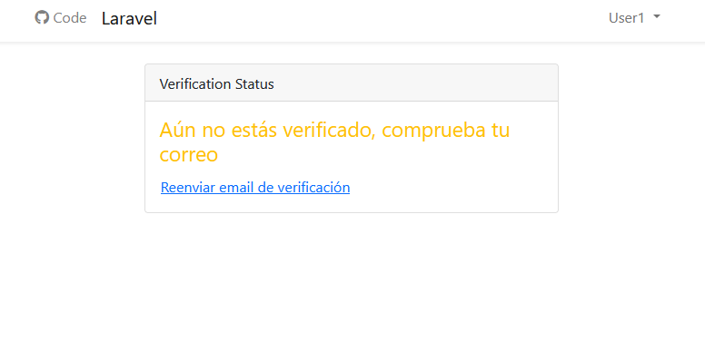
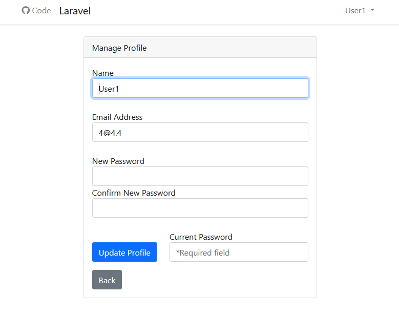

## User Administration App

Este proyecto es una aplicación Laravel que proporciona un sistema completo de administración de usuarios con diferentes roles y niveles de acceso.

### Características

- Sistema de autenticación y registro de usuarios
- Verificación de email
- Gestión de roles (usuario, admin, superadmin)
- Panel de administración
- Gestión de perfiles de usuario
- Sistema de recuperación de contraseñas
- Middleware de protección de rutas por roles

### Configuración del Proyecto

1. Clonar el repositorio:
```bash
git clone https://github.com/rtro-dev/User_Administration_App.git
```

2. Configurar permisos:
```bash
sudo chown -R user:www-data User_Administration_App/  
sudo chmod -R 775 User_Administration_App/
```

3. Acceder al directorio:
```bash
cd userApp/
```

4. Instalar dependencias:
```bash
sudo composer require laravel/ui
sudo composer install
```

5. Configurar base de datos:
    - Crear base de datos y usuario
    - Copiar .env.example a .env
    - Actualizar credenciales en .env

6. Ejecutar migraciones:
```bash
php artisan migrate
```

7. Instalar sistema de autenticación:
```bash
php artisan ui:auth
```

### Estructura de Roles

- **Usuario**: Acceso básico al sistema
- **Admin**: Gestión de usuarios regulares
- **SuperAdmin**: Control total del sistema

### Seguridad

- Middleware personalizado para protección de rutas
- Sistema de verificación de email
- Protección CSRF
- Encriptación de contraseñas

## Controladores

Los controladores manejan la lógica de negocio y el procesamiento de datos de la aplicación. Actúan como intermediarios entre las capas de modelo y vista.

### Controlador de Usuario
- Gestiona la autenticación de usuarios
- Maneja el registro de usuarios
- Procesa actualizaciones de perfiles

### Controlador de Productos
- Controla el listado de productos
- Gestiona la creación/actualización de productos
- Maneja la búsqueda y filtrado de productos

## Rutas

La configuración de rutas define las URLs y las mapea a las acciones del controlador.

### Rutas de Usuario
- GET /users - Listar usuarios
- POST /users - Crear nuevo usuario
- GET /users/:id - Mostrar detalles de usuario
- PUT /users/:id - Actualizar usuario
- DELETE /users/:id - Eliminar usuario

### Rutas de Productos
- GET /products - Catálogo de productos
- POST /products - Añadir producto
- GET /products/:id - Detalles del producto
- PUT /products/:id - Actualizar producto
- DELETE /products/:id - Eliminar producto

## Vistas

Las vistas manejan la capa de presentación y los elementos de la interfaz de usuario.

### Vistas de Usuario
- Formulario de inicio de sesión
- Formulario de registro
- Página de perfil
- Listado de usuarios

### Vistas de Productos
- Cuadrícula del catálogo de productos
- Página de detalles del producto
- Formulario de edición de producto
- Panel de administración de productos

## Imágenes








